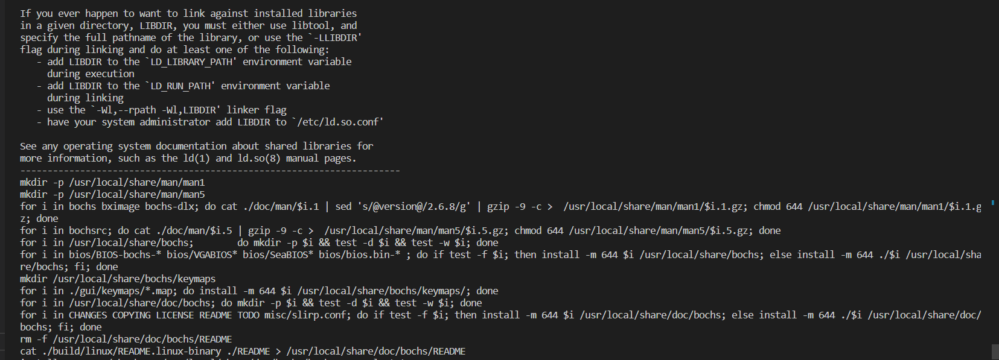

> 使用centos7   (遇到坑不少)

# bochs-gdb安装(2.7)

由于bochs的GDB要么本地要么远程, 所以我们得整两个bochs, 这个就当bochs-gdb

> 参考地址   https://zhuanlan.zhihu.com/p/492780020

## 依赖库安装

```sh
sudo yum install gtk2 gtk2-devel libXt libXt-devel libXpm libXpm-devel SDL SDL-devel libXrandr-devel.x86_64 xorg-x11-server-devel glibc-headers gcc-c++ SDL SDL-devel
```

## 安装nasm

```
wget https://www.nasm.us/pub/nasm/releasebuilds/2.15.05/nasm-2.15.05.tar.gz
tar xvzf nasm-2.15.05.tar.gz
cd nasm-2.15.05
./configure
make
sudo make install

```


## 下载bochs

```
wget https://sourceforge.net/projects/bochs/files/bochs/2.7/bochs-2.7.tar.gz --no-check-certificate
tar xvfz bochs-2.7.tar.gz
mv bochs-2.7 bochs-gdb
cd bochs-gdb
```

## 配置文件

```
./configure --with-x11 --with-x --enable-all-optimizations --enable-readline --enable-a20-pin --enable-fast-function-calls --enable-gdb-stub
```

> ./configure --with-x11 --with-wx  --enable-disasm --enable-all-optimizations --enable-readline --enable-long-phy-address --enable-ltdl-install --enable-idle-hack --enable-plugins --enable-a20-pin --enable-x86-64 --enable-cpu-level=6 --enable-large-ramfile --enable-repeat-speedups --enable-fast-function-calls  --enable-handlers-chaining  --enable-trace-linking --enable-configurable-msrs --enable-show-ips --enable-cpp --enable-debugger-gui --enable-iodebug --enable-logging --enable-assert-checks --enable-fpu --enable-vmx=2 --enable-svm --enable-3dnow --enable-alignment-check  --enable-monitor-mwait --enable-avx  --enable-evex --enable-x86-debugger --enable-pci --enable-usb --enable-voodoo --enable-gdb-stub


## 复制文件(保留,不需要执行, 这个是2.6.8遗留)

```
cp misc/bximage.cpp  misc/bximage.cc
cp iodev/hdimage/hdimage.cpp iodev/hdimage/hdimage.cc
cp iodev/hdimage/vmware3.cpp  iodev/hdimage/vmware3.cc
cp iodev/hdimage/vmware4.cpp iodev/hdimage/vmware4.cc
cp iodev/hdimage/vpc-img.cpp iodev/hdimage/vpc-img.cc
cp iodev/hdimage/vbox.cpp iodev/hdimage/vbox.cc
```

## 修改makefile

vim Makefile

```sh
# prefix          = /usr/local
prefix          = /usr/local/bochs-gdb # 修改为你要存放的目录位置
exec_prefix     = ${prefix}
srcdir          = .

bindir          = ${exec_prefix}/bin
libdir          = ${exec_prefix}/lib
plugdir         = ${exec_prefix}/lib/bochs/plugins
datarootdir     = ${prefix}/share
mandir          = ${datarootdir}/man
man1dir         = $(mandir)/man1
man5dir         = $(mandir)/man5
docdir          = $(datarootdir)/doc/bochs
sharedir        = $(datarootdir)/bochs
top_builddir    = .
top_srcdir      = $(srcdir)

```

## 构建

```
sudo make && sudo make install
```



显示是这样就代表安装成功了

然后可以查看/usr/local/share  /usr/local/bin 下面就有了 对应的东西

## 复制到bin目录下

```
cp /usr/local/bochs-gdb/bin/bochs /usr/local/bin/bochs-gdb  
cp /usr/local/bochs-gdb/bin/bximage /usr/local/bin/
```


## 创建硬盘

> 不同的bochs对应的bximage参数可能不同

```
yes | bximage -q -hd=16 -func=create -sectsize=512 -imgmode=flat maste
```

> 记录下来配置项  ata0-master: type=disk, path="master.img", mode=flat

## 创建bochsrc-gdb

```sh
# configuration file generated by Bochs
plugin_ctrl: unmapped=1, biosdev=1, speaker=1, extfpuirq=1, parallel=1, serial=1
config_interface: textconfig
display_library: x
memory: host=32, guest=32
romimage: file="/usr/local/bochs-gdb/share/bochs/BIOS-bochs-latest"   # 修改为我们上面修改的目录
vgaromimage: file="/usr/local/bochs-gdb/share/bochs/VGABIOS-lgpl-latest" # 修改为我们上面修改的目录
boot: disk  # 硬盘启动
floppy_bootsig_check: disabled=0
# no floppya
# no floppyb
ata0: enabled=1, ioaddr1=0x1f0, ioaddr2=0x3f0, irq=14
ata0-master: type=disk, path="./build/master.img", mode=flat  # 这里的相对地址要写对,  我这里是已经创建好了硬盘在/build/master.img下面了
ata0-slave: type=none
ata1: enabled=1, ioaddr1=0x170, ioaddr2=0x370, irq=15
ata1-master: type=none
ata1-slave: type=none
ata2: enabled=0
ata3: enabled=0
pci: enabled=1, chipset=i440fx
vga: extension=vbe, update_freq=5, realtime=1
cpu: count=1, ips=4000000, model=bx_generic, reset_on_triple_fault=1, cpuid_limit_winnt=0, ignore_bad_msrs=1, mwait_is_nop=0
cpuid: level=6, stepping=3, model=3, family=6, vendor_string="AuthenticAMD", brand_string="AMD Athlon(tm) processor"
cpuid: mmx=1, apic=xapic, simd=sse2, sse4a=0, misaligned_sse=0, sep=1, movbe=0, adx=0
cpuid: aes=0, sha=0, xsave=0, xsaveopt=0, avx_f16c=0, avx_fma=0, bmi=0, xop=0, fma4=0
cpuid: tbm=0, x86_64=1, 1g_pages=0, pcid=0, fsgsbase=0, smep=0, smap=0, mwait=1, vmx=1
cpuid: svm=0
print_timestamps: enabled=0
# no gdb stub
gdbstub: enabled=1, port=1234   # 这里配置gdb启动端口
port_e9_hack: enabled=0
private_colormap: enabled=0
clock: sync=none, time0=local, rtc_sync=0
# no cmosimage
# no loader
log: -
logprefix: %t%e%d
debug: action=ignore
info: action=report
error: action=report
panic: action=ask
keyboard: type=mf, serial_delay=250, paste_delay=100000, user_shortcut=none
mouse: type=ps2, enabled=0, toggle=ctrl+mbutton
speaker: enabled=1, mode=system
parport1: enabled=1, file=none
parport2: enabled=0
com1: enabled=1, mode=null
com2: enabled=0
com3: enabled=0
com4: enabled=0

```

## 创建启动脚本

```
export LTDL_LIBRARY_PATH=/usr/local/bochs-gdb/lib/bochs/plugins 
export BXSHARE=/usr/local/bochs-gdb/share/bochs 
bochs-gdb -q -f bochsrc-gdb
```

## 创建启动makefile

和上面二选一即可

```
debug: $(BUILD)/master.img

	LTDL_LIBRARY_PATH=/usr/local/bochs-gdb/lib/bochs/plugins \
	BXSHARE=/usr/local/bochs-gdb/share/bochs \
	bochs-gdb -q -f $(WORKDIR)/bochs/bochsrc-gdb
```


# bochs安装


## 再解压一份bochs

```sh
tar xvfz bochs-2.7.tar.gz
mv bochs-2.7 bochs
cd bochs
```

## 配置文件

```
./configure --with-x11 --with-x --enable-all-optimizations --enable-readline --enable-a20-pin --enable-fast-function-calls  --enable-x86-debugger   --enable-debugger

```

> 
>
> ./configure --with-x11 --with-wx --enable-debugger --enable-all-optimizations --enable-readline --enable-long-phy-address --enable-ltdl-install --enable-idle-hack --enable-plugins --enable-a20-pin --enable-x86-64 --enable-smp --enable-cpu-level=6 --enable-large-ramfile --enable-repeat-speedups --enable-fast-function-calls  --enable-handlers-chaining  --enable-trace-linking --enable-configurable-msrs --enable-show-ips --enable-cpp --enable-debugger-gui --enable-iodebug --enable-logging --enable-assert-checks --enable-fpu --enable-vmx=2 --enable-svm --enable-3dnow --enable-alignment-check  --enable-monitor-mwait --enable-avx  --enable-evex --enable-x86-debugger --enable-pci --enable-usb --enable-voodoo 
>
> --enable-gdb-stub  和 --enable-debugger 是互斥的,  --enable-debugger 是本地调试  --enable-gdb-stub 是远程调试

## 复制文件(不需要执行)

```
cp misc/bximage.cpp  misc/bximage.cc
cp iodev/hdimage/hdimage.cpp iodev/hdimage/hdimage.cc
cp iodev/hdimage/vmware3.cpp  iodev/hdimage/vmware3.cc
cp iodev/hdimage/vmware4.cpp iodev/hdimage/vmware4.cc
cp iodev/hdimage/vpc-img.cpp iodev/hdimage/vpc-img.cc
cp iodev/hdimage/vbox.cpp iodev/hdimage/vbox.cc
```

## 修改makefile

vim Makefile

```sh
# prefix          = /usr/local
prefix          = /usr/local/bochs # 修改为你要存放的目录位置, 注意区别,上面是bochs-gdb
exec_prefix     = ${prefix}
srcdir          = .

bindir          = ${exec_prefix}/bin
libdir          = ${exec_prefix}/lib
plugdir         = ${exec_prefix}/lib/bochs/plugins
datarootdir     = ${prefix}/share
mandir          = ${datarootdir}/man
man1dir         = $(mandir)/man1
man5dir         = $(mandir)/man5
docdir          = $(datarootdir)/doc/bochs
sharedir        = $(datarootdir)/bochs
top_builddir    = .
top_srcdir      = $(srcdir)

```

## 构建

```
sudo make && sudo make install
```

## 复制到bin目录下

```
cp /usr/local/bochs/bin/bochs /usr/local/bin/bochs 
cp /usr/local/bochs/bin/bximage /usr/local/bin/bximage
```


## 编写boot.asm

```
[org 0x7c00]

; 设置屏幕模式为文本模式，清除屏幕
mov ax, 3
int 0x10

; 初始化段寄存器
mov ax, 0
mov ds, ax
mov es, ax
mov ss, ax
mov sp, 0x7c00

mov si, 0

; 屏幕显示区域
mov ax,0xb800
mov ds,ax
; 显示字符H
mov byte [0],'H'   

; 阻塞
jmp $


; 填充 0
times 510 - ($ - $$) db 0

; 主引导扇区的最后两个字节必须是 0x55 0xaa
; dw 0xaa55
db 0x55, 0xaa
```

编译boot.asm

```
nasm -f bin boot.asm -o boot.bin
```

将boot.bin写入主引导扇区

```
dd if=boot.bin of=master.img bs=512 count=1 conv=notrunc
```

## 修改bochs启动配置项

```sh
# configuration file generated by Bochs
plugin_ctrl: unmapped=1, biosdev=1, speaker=1, extfpuirq=1, parallel=1, serial=1, iodebug=1
config_interface: textconfig
display_library: x,options="gui_debug"  # 可视化调试
memory: host=32, guest=32
romimage: file="/usr/local/bochs/share/bochs/BIOS-bochs-latest"  # 修改为我们上面修改的目录
vgaromimage: file="/usr/local/bochs/share/bochs/VGABIOS-lgpl-latest"  # 修改为我们上面修改的目录
boot: disk  #硬盘启动
floppy_bootsig_check: disabled=0
# no floppya
# no floppyb
ata0: enabled=1, ioaddr1=0x1f0, ioaddr2=0x3f0, irq=14
ata0-master: type=disk, path="master.img", mode=flat
ata0-slave: type=none
ata1: enabled=1, ioaddr1=0x170, ioaddr2=0x370, irq=15
ata1-master: type=none
ata1-slave: type=none
ata2: enabled=0
ata3: enabled=0
pci: enabled=1, chipset=i440fx
vga: extension=vbe, update_freq=5, realtime=1
cpu: count=1:1:1, ips=4000000, quantum=16, model=bx_generic, reset_on_triple_fault=1, cpuid_limit_winnt=0, ignore_bad_msrs=1, mwait_is_nop=0
cpuid: level=6, stepping=3, model=3, family=6, vendor_string="AuthenticAMD", brand_string="AMD Athlon(tm) processor"
cpuid: mmx=1, apic=xapic, simd=sse2, sse4a=0, misaligned_sse=0, sep=1, movbe=0, adx=0
cpuid: aes=0, sha=0, xsave=0, xsaveopt=0, avx_f16c=0, avx_fma=0, bmi=0, xop=0, fma4=0
cpuid: tbm=0, x86_64=1, 1g_pages=0, pcid=0, fsgsbase=0, smep=0, smap=0, mwait=1, vmx=1
cpuid: svm=0
print_timestamps: enabled=0
debugger_log: -
magic_break: enabled=1
port_e9_hack: enabled=0
private_colormap: enabled=0
clock: sync=none, time0=local, rtc_sync=0
# no cmosimage
# no loader
log: -
logprefix: %t%e%d
debug: action=ignore
info: action=report
error: action=report
panic: action=ask
keyboard: type=mf, serial_delay=250, paste_delay=100000, user_shortcut=none
mouse: type=ps2, enabled=0, toggle=ctrl+mbutton
speaker: enabled=1, mode=system
parport1: enabled=1, file=none
parport2: enabled=0
com1: enabled=1, mode=null
com2: enabled=0
com3: enabled=0
com4: enabled=0

```

## 创建启动脚本

```
export LTDL_LIBRARY_PATH=/usr/local/bochs/lib/bochs/plugins 
export BXSHARE=/usr/local/bochs/share/bochs 
bochs -q -f bochsrc-gdb
```

## 创建启动makefile

和上面二选一即可

```
run: $(BUILD)/master.img
	LTDL_LIBRARY_PATH=/usr/local/bochs/lib/bochs/plugins \
	BXSHARE=/usr/local/bochs/share/bochs \
	bochs -q -f $(WORKDIR)/bochs/bochsrc
```

# 删除bochs

```
# 进入到bochs的解压目录
# 可以选择直接删除整个目录, 也可以删除一部分
rm -rf ./*
make uninstall
```

# 升级gcc

centos7 默认自带的gcc版本为4.8.5, 需要升级为11版本

```
sudo yum install centos-release-scl
sudo yum install devtoolset-11-gcc*
source /opt/rh/devtoolset-11/enable


mv /usr/bin/gcc /usr/bin/gcc-4.8.5

ln -s /opt/rh/devtoolset-11/root/bin/gcc /usr/bin/gcc

mv /usr/bin/g++ /usr/bin/g++-4.8.5

ln -s /opt/rh/devtoolset-11/root/bin/g++ /usr/bin/g++

gcc --version

g++ --version
```


# 升级gdb

```
mv /usr/bin/gdb  /usr/bin/gdb-7
sudo yum install texinfo  # 新版本的gdb需要这个东西
wget http://ftp.gnu.org/gnu/gdb/gdb-10.2.tar.gz
tar -xzvf gdb-10.2.tar.gz
cd gdb-10.2
./configure --prefix=/usr/     ## --prefix=/usr/参数实现自动配置环境变量
make
make install
```


# qemu安装

进入到root用户

```
yum install qemu-kvm
```

## 转换磁盘镜像文件

```
qemu-img convert -f raw -O vmdk boot.img boot.vmdk
```


# 参考

文章链接:

* [bochs配置](https://www.jianshu.com/p/00969a32dfae)
* [bochs配置](https://zhuanlan.zhihu.com/p/452578845)

书籍参考:

* 一个64位操作系统的设计与实现

# test

```
wget https://sourceforge.net/projects/bochs/files/bochs/2.6.11/bochs-2.6.11.tar.gz --no-check-certificate

tar xvfz bochs-2.6.11.tar.gz
cd bochs-2.6.11

wget https://sourceforge.net/projects/bochs/files/bochs/2.7/bochs-2.7.tar.gz --no-check-certificate
tar xvfz bochs-2.7.tar.gz
cd bochs-2.7

```

电源
