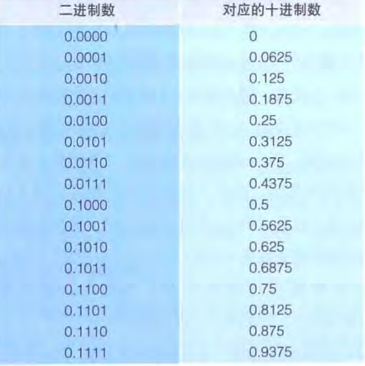
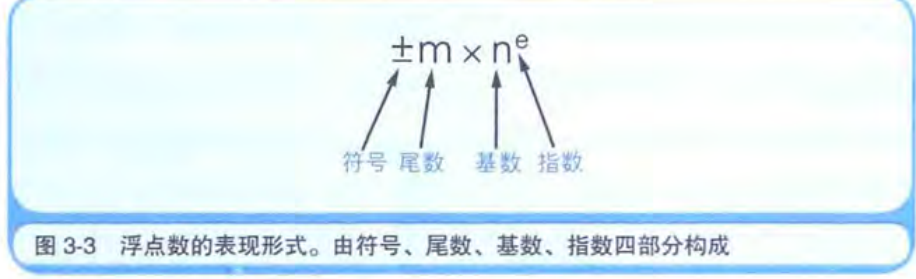
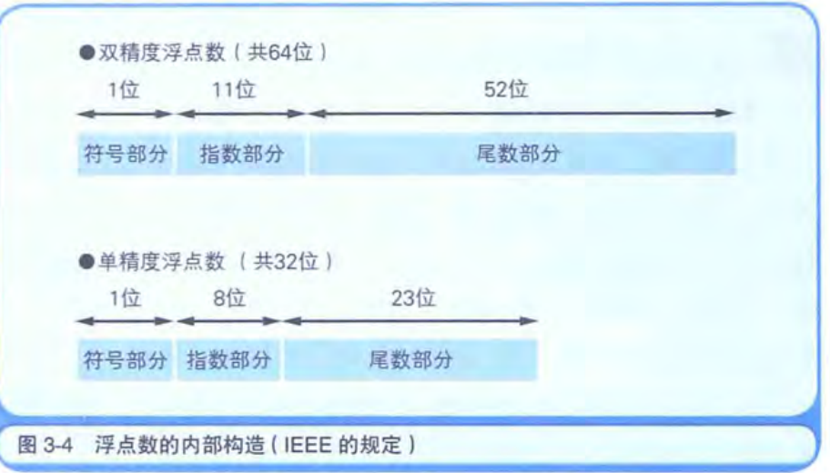
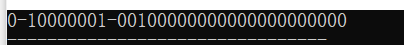

## 第三章 计算机进行小数运算时出错的原因

如果我们使用简单的二进制来表示小数,我们会发现二进制有时候根本表示不了很多小数



如果我们想让二进制表示一个0.1 他都表示不了,只能无限接近,因此在做运算的时候肯定会有误差的,当然我们也不会用这种二进制简单的来表示浮点数,人很聪明,想到了科学计数法,我们可以模仿这种方法来设计如何保存浮点数



### 浮点数的保存方法

一般的语言都会提供**double**(双精度),**float**(单精度)这两种方式记录浮点数




符号部分记录这个数的正负

**指数部分**保存指数的值(基数是2哦),这里不是简单的使用这个值去表示指数,而是以中间值为基准,中间值代表0,列如浮点数中

(11111111)/2 = 01111111  这个数代表0, 10000000 表示1 ,01111110 表示-1

**尾数部分**保存移位后的值,  移位的时候我们要保证小数点第一位左边第一位必须是1,而且左边只有一个1,右边不需要管,尾数部分记录的就是右边部分的值,这样是不是很巧妙,可以节省一位值

我们可以验证一下

```c
#include<iostream>
#include<string.h>
using namespace std;

int main(){
	
	float a = 4.5;
	unsigned long buf = 0;
	memcpy(&buf,&a,sizeof(float));
	for(int k=1;k<=32;k++){
		
		cout<<((buf>>(32-k))&1);
		if(k == 1 || k== 9){
			cout<<"-";
		}
	}
}
```

运行后输出:



我们计算一下:

符号部分: 正数

指数部分:  10000001 - 01111111 = 2 

尾数部分: ( 1\*(2^0) + 0 \* (2^-1) + 0 \* (2^-2) + 1 \* (2^-3) ) * 2^2 = 4.5   不要忘记还有个1的部分哦

## 第七章 运行环境

运行环境 = 操作系统 + 硬件

