## 第四章 手电筒的剖析

这章感觉像电路知识,哈哈哈哈

电池是通过化学反应将电子从正极移动到负极,如果有导线连接正负极的时候,化学反应才会发生的很快,如果电池没有连接导线,那么化学反应会发生的很慢很慢(不代表不发生,因为负极的电子也可能跑掉,正极补充到电子)

电子是很难直接通过空气流动的,物质的导电能力是由它的核外电子结构决定的,如果最外电子层只有一个电子,那么这个电子是很容易逃逸的

对于电流能够流通的的物体我们叫做**导体**,对于那些几乎不能导电的物体,我们叫做**绝缘体**,**但是不存在理想绝缘体,这些绝缘体就相当于一个阻值很大很大的电阻罢了,通过他的电流非常小,小到可以忽略不计,当我们有足够大的电压时,也能产生很大的电流**

那些导电性很好的导体也具有阻性,只不过他们的电阻比较小罢了,导线越长,电阻越大,导线越粗,电阻越小,这是为什么呢,导线越粗,电子可以选择的通路就越多

电子在高速移动的过程中,也会产生摩擦吧,这样是不是就会发热?,如果导线直接连接电视两端,而阻值比较小, 那这样的话,导线就会持续发热,然后就会烧掉

电流只有有和无,灯泡的也只有发光和不发光,因此这是不是也是二进制的一种体现

## 第五章 绕过拐角的通信

crazying,居然可以用地球当导体,这个跟上一节讲的导线越粗电子越小,只要给足够的电压,任何东西可以导电,那么地球是不是也可以这么理解啊,我去,但是这个电压是需要非常大的

## 第十一章 门

我们知道用导线一圈一圈围绕在铁棒上,通电后可以产生磁性跟磁铁一样,断电后又不具有磁性了,这个东西叫继电器,那么我是不是可以用继电器来充当开关,通电代表打开,没电代表关闭

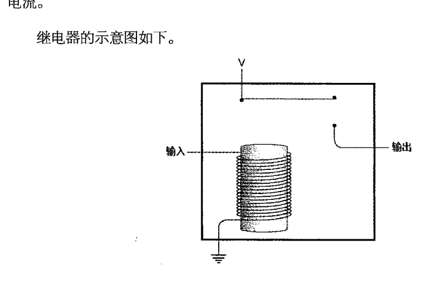

这样我们就能造出很多逻辑门

### 与门 (AND)

只有当所有的输入端都为1时才能输出1,否则就是0,这个就是与门

用在这个图里解释就是,只有所有通电器通电了,灯泡才能亮

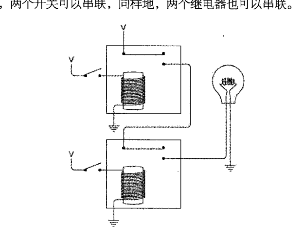

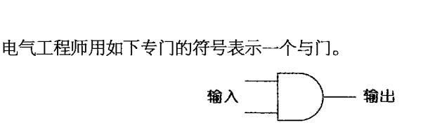

因此我们可以将上面那张继电器的图表示为

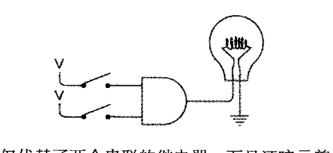

上面只有两个输入端,其实我们可以用多个与门制造多个输入端

比如这样

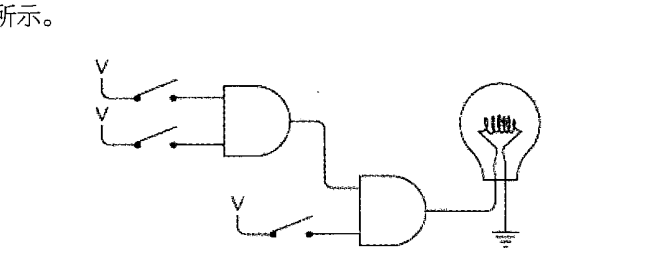

### 或门(OR)

只要所有的输入端中只要有一个输入为1,输出就是1

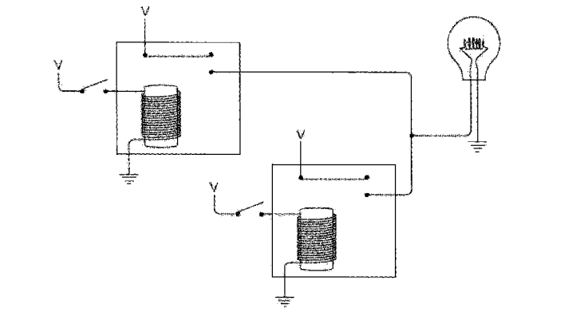

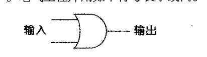

### 非门(NOT)

输出和输入端相反

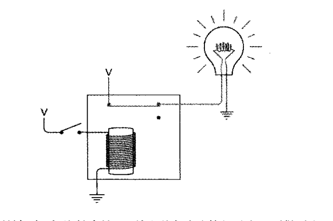

### 或非门(NOR)

这个可以理解为一个或门串联一个非门,但实际上还是只有两个继电器

只要输入端中有1,就输出0,否则就输出1

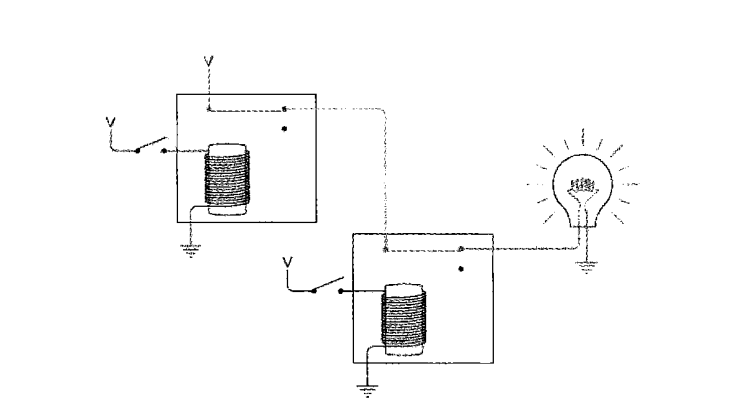

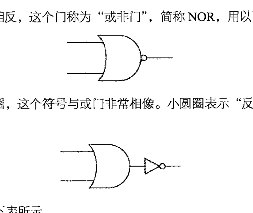

### 与非门(NAND)

这个可以理解为一个与门与一个或门连接

只要输入端有0,就输出1,否则就输出0

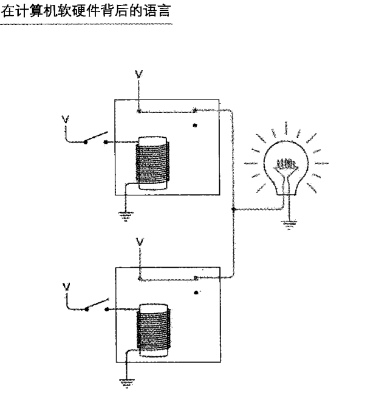

### 异或门

这个就不用说了

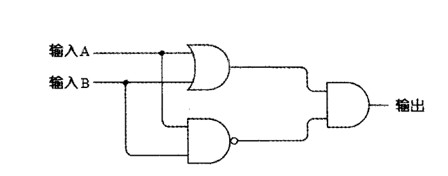

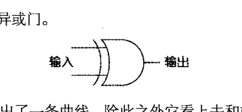

### 缓冲器

一个最原始的继电器就是一个缓冲器

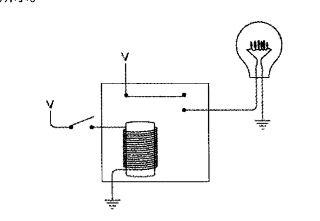

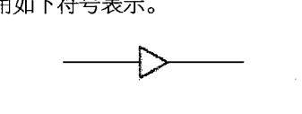

它的输入跟输出是一样的,当输入信号很微弱的时候,可以使用缓冲器增强信号(因为继电器只需要很小的信号就可以运行,它运行后输入的信号可以强的多),另外,还可以延迟信号

## 第十二章 二进制加法器

### 半加器

一位加法 可以产生一个和,一个进位

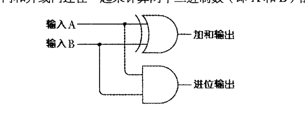

我们用下面这种方法表示一位加法器,也叫半加器

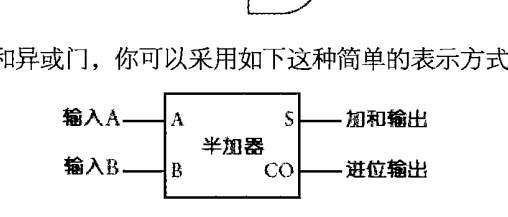

叫半加器是因为,对于有两个二进制位的数字相加,第一次相加只有两位数据,而第二次相加有三位数据(两个加法位,一个进位),因此我们还需要一个全加器(三位加法运算)

### 全加器

三位加法器被称为全加器

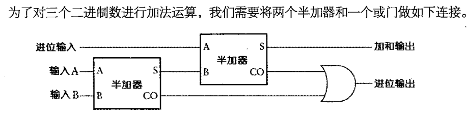

为了方便都用这种方法记做全加器

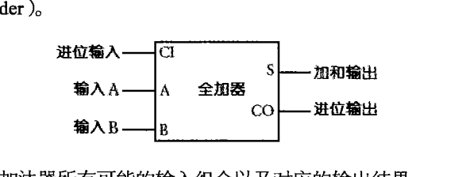

### 多位加法器

利用全加器,我们可以制作多位加法器

八位加法器

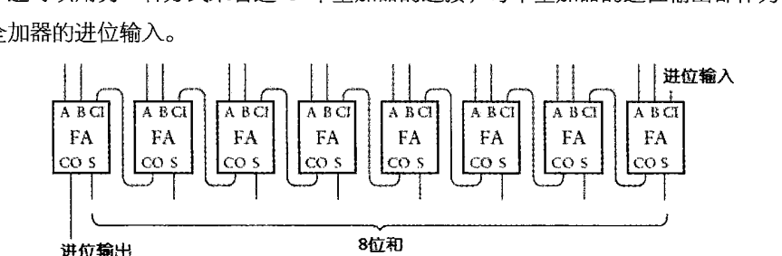

16位加法器

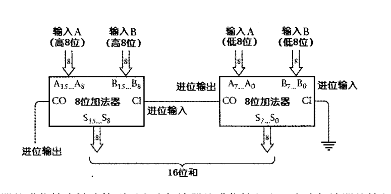

> 现在我们一般不用继电器了,体积大,噪声大,现在一般使用晶体管,虽然材料不一样,但是原理都是一样的

## 第十四章 反馈与触发器

### 振荡器

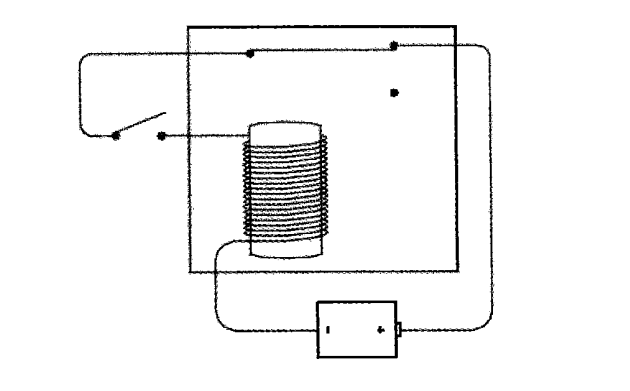

我去,这个图有点意思,当我们把开关关下去之后,铁棒会带有磁性,然后将金属弹片拉下来

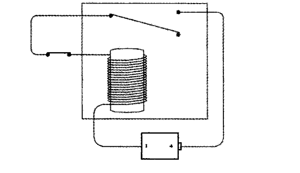

然后电路断开,金属弹片又会回去

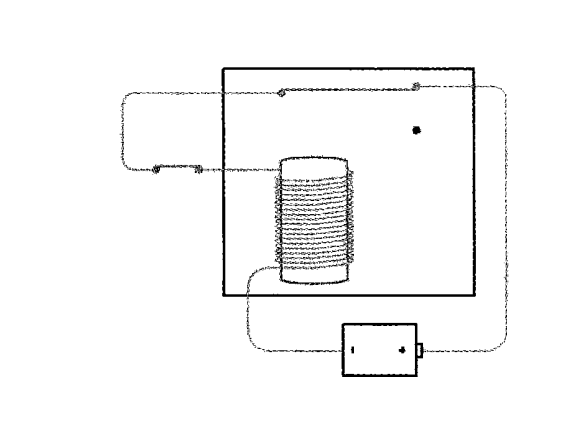

这样是不是就循环起来了,如果有击打声,那岂不是就是电铃了

这个其实就是振荡器,它的电子元件图有点看着别扭,不太好理解

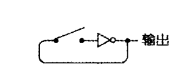

振荡器输出按某种规律进行,我们可以测出它的周期,进而得到它的频率

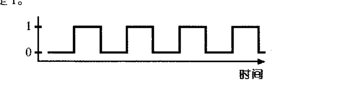

我们使用HZ来当振荡器的频率单位,比如:

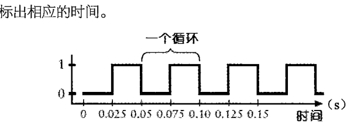

这个振荡器每0.05s就是一个循环,那么它的频率就是 1/0.05 = 20HZ   就是1秒钟循环20次震荡

### 锁存器

#### RS锁存器

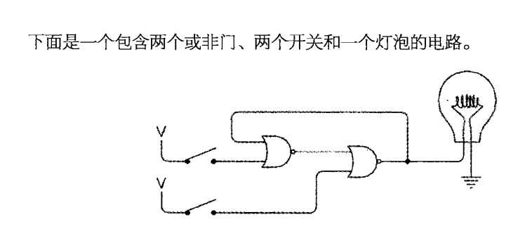

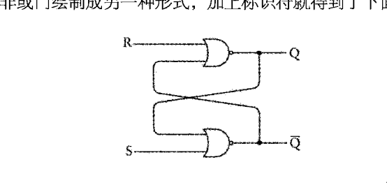

卧槽这个东西又比较吊了,它居然可以存储状态

当我们给上边这个开关关上(就是输入1),然后左边这个或非门输出0,下面这个开关没有合上,所以右边这个或非门输出1,所以灯泡亮了,然而,我们会发现这个时候,上面这个开关是否开合都不能影响这个电路的最后输出了,

可以存储状态的两个或非门电路中，**右边的或非门的继电器的电源开关通常是由左边的或非门的输出控制的**。**这种电路被称为 SR（Set-Reset）或闪存器**。**左边的或非门可以被视为“设置”输入**，**右边的或非门可以被视为“重置”输入**。当左边的或非门的输出为1时，它会将右边的继电器开关置为1，从而存储一个状态。当左边的或非门的输出为0时，它会将右边的继电器开关置为0，从而重置存储的状态。

> 其实这个R 和 S 是相对的,是要看输出的Q 与 Q'  如果要的输出值是Q,那么R就是reset端,S就是Set端,如果要的输出值是Q',那么就反过来

需要注意的是，这种电路有可能处于不稳定的状态，即所存储的状态不明确或者不符合预期。因此，在实际应用中，需要使用更加复杂的电路来保证稳定性，比如使用时钟信号来控制存储和读取操作。

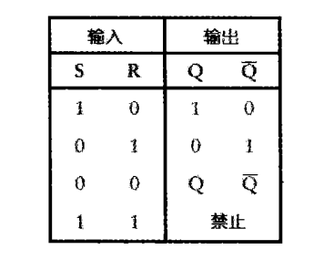

这里就算我们输入1, 1 其实也不会对电路造成任何影响,只不过这样没有任何意义,我们可以简化这个RS触发器

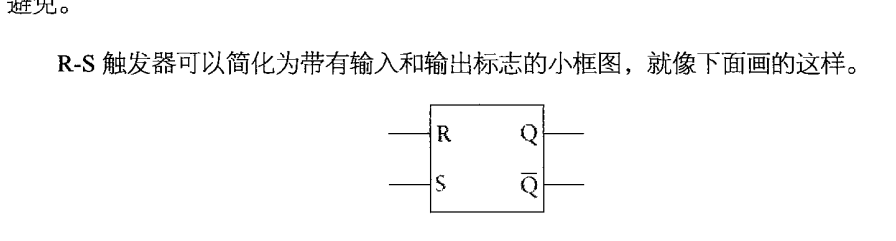

**其实这个电路有个缺点,就是我们并不知道这个一开始的输出是什么,它是随机的,因此我们需要一个预设个清零**

通常情况下,我们使用跟好的电路来代替这个触发器,这样可以避免一些误操作

> 我们要保证R和S 必须相反,所以我们有了如下电路,时钟用来控制可以写入和重置

#### D锁存器

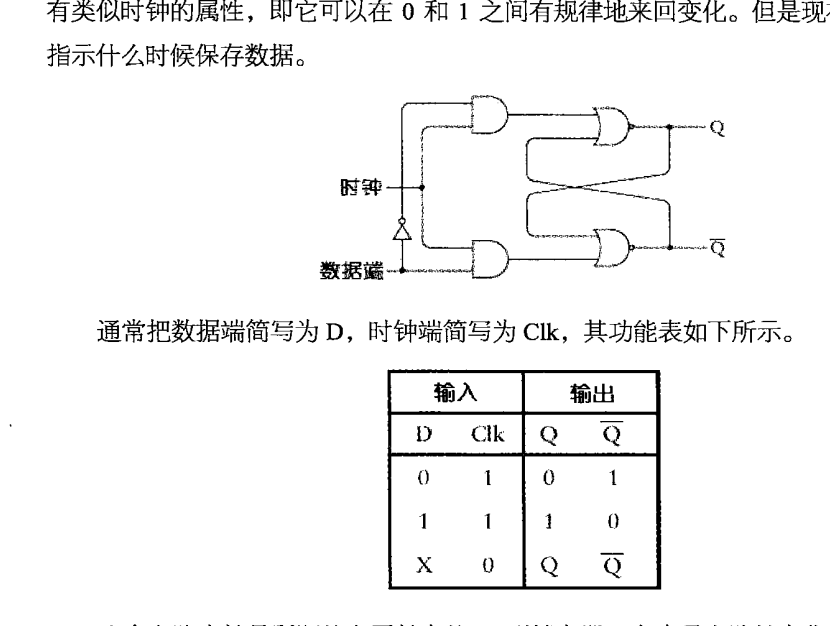

这个是一位锁存器,我们平时当然是八位一起的

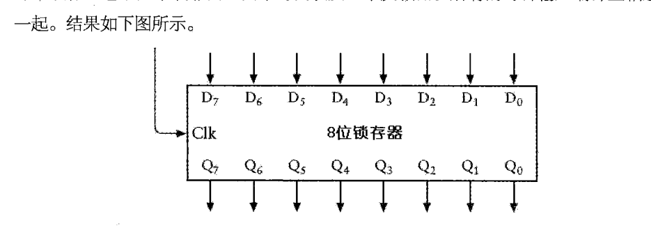

#### D边缘触发器

这个电路只有当时钟从低电平变到高电平才有效

因为,在两个D锁存器中,一次只能设置一个锁存器,而当时钟是低电平的时候,我们只能设置第一个锁存器,而如果时钟处于高电平的时候,第一个锁存器的数据会变到第二个锁存器中,而此时第一个锁存器的数据也已经无法改变,所以只有在低电平的时候事先将数据放到数据端,等到时钟从0跳变到1的时候数据会从第一个锁存器中变输入到第二个锁存器中

时钟低电平:  只能设置第一个锁存器

时钟高电平: 第一个锁存器不能被设置数据,第二个锁存器被设置成第一个的数据

如果我们想更改第二个锁存器数据,必须在低电平期间设置数据端

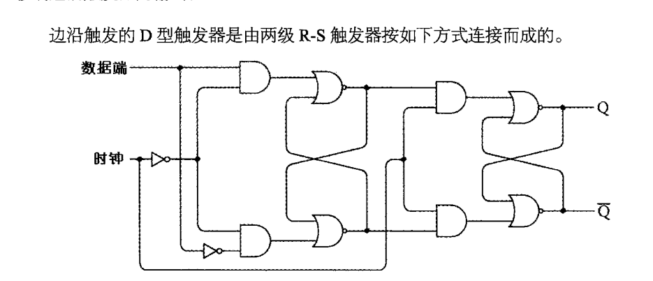

#### 更完美的D边缘触发器

上面的触发器有个缺点就是,在一开始R-S的输出都是随机的,

前面我们只有两个输入位,这个有四个输入位,预置和清零都会覆盖时钟和数据的输入

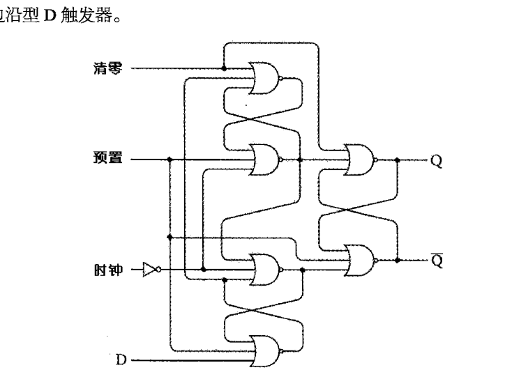

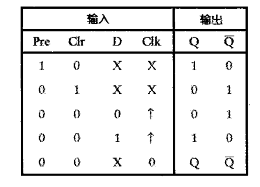

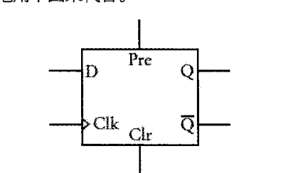

### 分频器(T触发器)

这个是由**D边缘触发器**与振荡器相连,时钟从低电平变到高电平的时候才会改变一次状态

> 这里如果采用锁存器和D触发器就会发生震荡,因为时钟信号会有一段时间处于高电平的状态,这个时间段D可以设置数据的话,那么会飞快的交替0和1

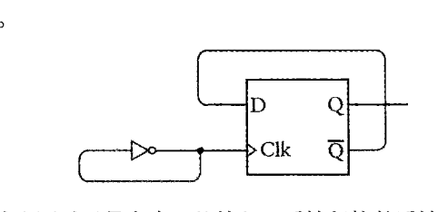

这个电路的Q输出端的频率变化是CLK 的一半,因此是不是也就分频了,如果多个分频器相连,就会有分的更小

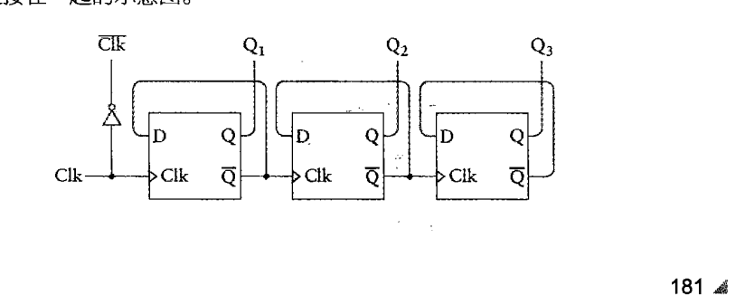

我们来看周期图,并且标上0/1

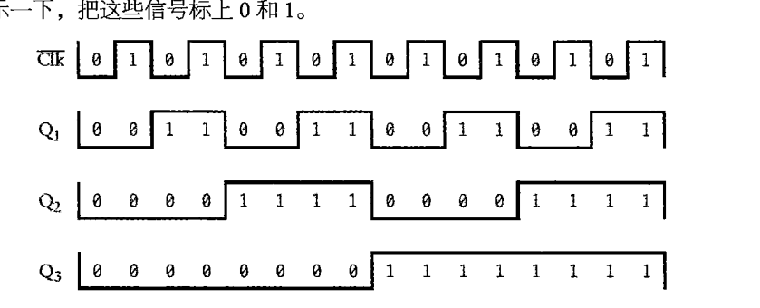

倒过来看,是不是就是一个二进制的进位表

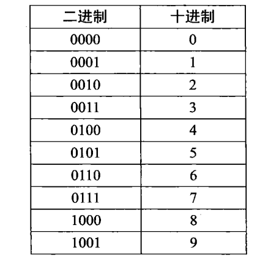

### 计数器

> 我们通过连接多个T触发器的电路可以发现,第一个T触发器从低电平到高电平跳变两次,第二个触发器才跳变一次,这个是不是就是二进制了?,逢二进一

我们将多个分频器相连是不是就变成了计数器

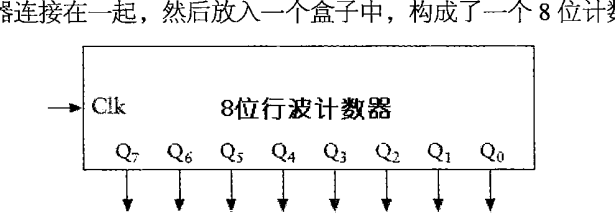

因此我们可以通过计数器来测试时钟频率,把这些输出全部连上灯泡,打开开关后开始计时,等到下一次灯泡全部熄灭了后 停止计时,然后用2的灯泡个数次幂除以时间就得到频率了

## 第十六章 存储器组织

### 三八译码器

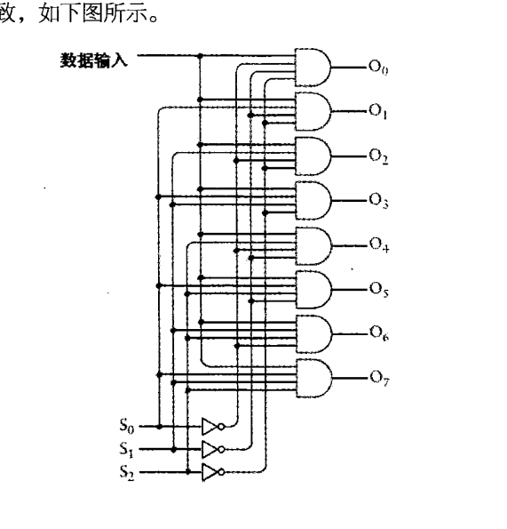

### 八一选择器

这个就是在三八译码器的基础上加了一个8端口或门

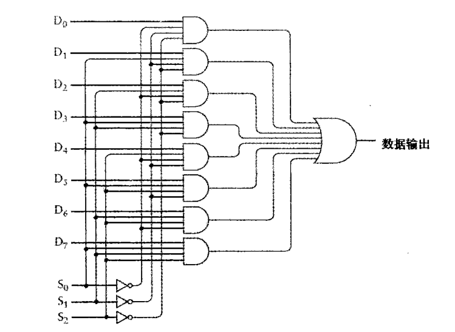

## 第十七章 自动操作

我们来看看自动进行累加操作吧

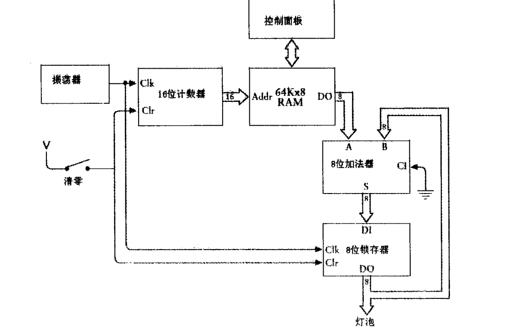

由于这个系统没有硬盘,所以数据必须我们自动提供

我们需要通过控制面板去手动将数据输入到指定位置

来说一下这个过程吧

首先必须合上清零开关,让震荡器一直处于0这个计数位置,那个8位锁存器也全部处于0数据,然后通过控制面板输入数据,最后打开清零开关,这个时候震荡器开始计数,将制定地址输入到RAM中,然后RAM输出指定位置数据到加法器中,然后将加法器中的数据和锁存器的数据相加,然后将输入写会锁存器,以此往复

这个缺点有点大,它根本不会停止,我们也不知道什么时候要停止

因此我们需要更加复杂的自动加法器,进而需要设置更复杂的电路来识别我们所给的指令

**硬件**就是实实在在看到东西,开关,显示屏,键盘,而**软件**就是代码和指令,叫做软件主要是因为他们很容易被修改

## 第十八章 从算盘到芯片

在冯洛伊曼提出存储程序之前,人们都是用纸带存储数据

### 晶体管

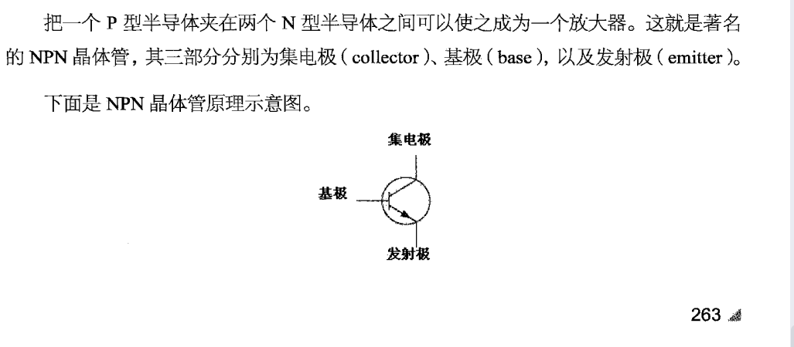

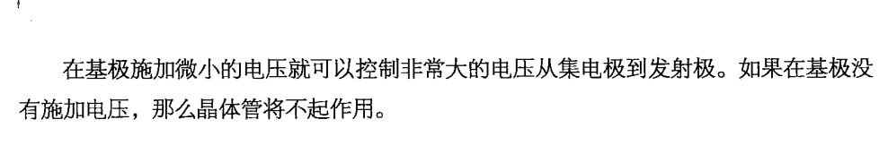

我们来看看晶体管的与门与或门吧

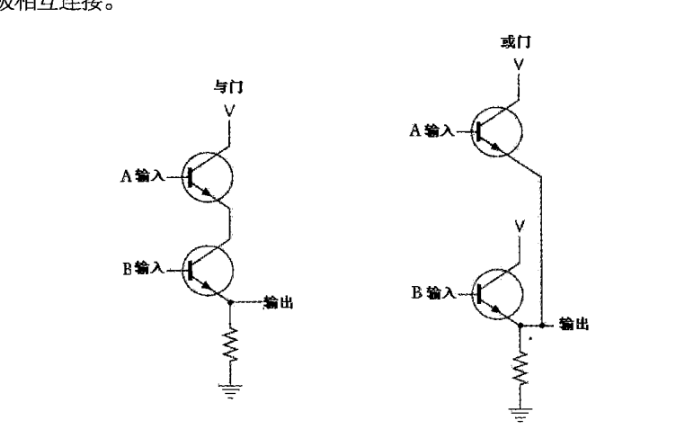

使用晶体管可以减少计算机的体积,电量,但是无法简化计算机的结构,相反,晶体管更小,要将这么多晶体管连线起来,也不是件容易事,

因此我们可以将晶体管先组合成门,然后通过这些门去连接成振荡器,加法器等等,在有这些东西去组成更强大的东西,然后构成集成电路

