## 时序图

我们可以通过一条一条语句来声明步骤,-> 代表实线

```
@startuml
用户 -> 认证中心: 登录操作
认证中心 -> 缓存: 存放(key=token+ip,value=token)token
用户 <- 认证中心 : 认证成功返回token
用户 -> 认证中心: 下次访问头部携带token认证
认证中心 <- 缓存: key=token+ip获取token
其他服务 <- 认证中心: 存在且校验成功则跳转到用户请求的其他服务
其他服务 -> 用户: 信息
@enduml
```

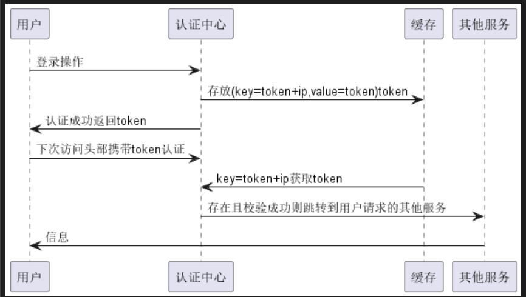

#### 声明参与者

上面那些框框都是可以变换形状的,我们只需要更改参与者的类型就可以了,可以指定的类型有

* actor（角色）
* boundary（边界）
* control（控制）
* entity（实体）
* database（数据库）
* collections（集合）
* queue（队列）

格式就是:

participant  "participantname" as participantothername 样式(颜色,顺序)

participant  participantothername as "participantname" 样式(颜色,顺序)

取别名的意义就在与,显示的时候显示的是真正的名字,写的时候可以写别名,如果真正的名字很长的话,我们可以通过取别名的方式简化

#### 箭头样式

* -> 代表实线大箭头
* ->x 代表X箭头,就是不可达或者丢失
* -\代表只有上箭头
* -/代表只有下箭头
* ->> 代表小(细)箭头
* -- 代表虚线
* ->o 箭头末尾加圈
* <-> 双向箭头
* 在第一个-后面修改箭头颜色   -[#red]>   红实线    -[#red]-> 红虚线

```
@startuml
actor actor1 as a1 #red 
actor actor2 as a2 #blue 
a1 -> a2
a1 ->x a2
a1 -\ a2
a1 -/ a2
a1 ->> a2
a1 --> a2
a1 ->o a2
a1 <-> a2
a1 -[#red]> a2 
@enduml
```

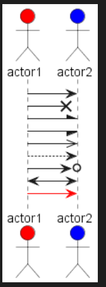

#### autonumber

autonumber 添加这个可以自动对消息编号  

* autonumber  startno  指定起始编号

* autonumber startno step 指定起始编号以及递增数量

* autonumber  样式   这里可以通过html指定编号样式

* autonumber stop 停止使用自动编号

* autonumber  resume  继续使用编号

  ```
  @startuml
  actor actor1 as a1 #red 
  actor actor2 as a2 #blue 
  
  autonumber 0 1 "<font color=red>message 000</font>"
  a1 -> a2: hello world
  a2 -> a1: hello world1
  @enduml
  ```

  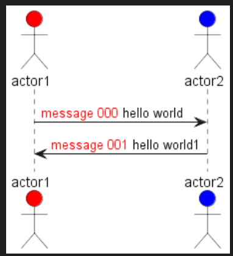

#### 页眉页脚标题

* title name  指定页面标题
* header name 增加页眉
* footer format 增加页脚
* newpage  用来分割页面,使用一个newpage 分割一个页面变成两个页面  newpage title  指定下一个页面的标题

```
@startuml
header Page Header
footer Page %page% of %lastpage%
title Example Title
Alice -> Bob : message 1
Alice -> Bob : message 2
newpage
Alice -> Bob : message 3
Alice -> Bob : message 4
newpage A title for the\nlast page
Alice -> Bob : message 5
Alice -> Bob : message 6
@enduml
```

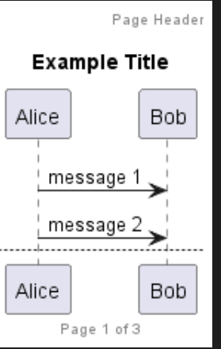

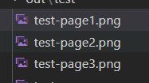

生成了三张图片

#### 组合消息

* alt/else  有点像if else的关系
* loop  循环次数    循环
* group  主标签  次标签

```
@startuml
a->b: 给你一个数
group 判断数字 [测试]
    alt 大于0
        b->a: 正数
    else 小于0
        b->a: 负数
    else 不是数字
        b->a: 给定信息非法,重新给我一个数
    end
end
@enduml
```

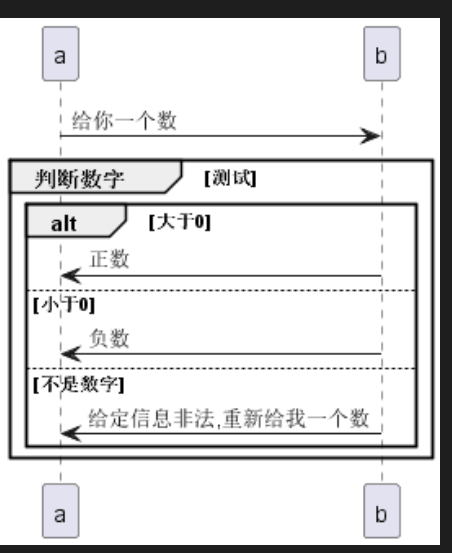

#### 给消息添加注释

* note left  在左边添加注释
* note right在右边添加注释
* note left/right   end note  添加多行注释
* note left/right of 参与者 颜色    指定在注释在参与者的哪边
* note over 参与者 .... 贯穿参与者
* 如果两个备注要在同一行需要使用 /

```
@startuml
note left of a: 初始化
/ note right of b: 初始化

note across: 共同协作

@enduml
```

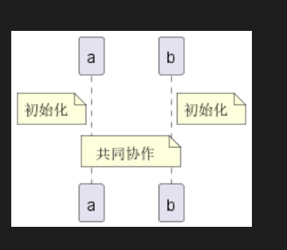

#### 分隔符

使用分割符,可以将图表分割成多个逻辑步骤

* == ==

```
@startuml

== 初始化 ==
note left of a: 初始化
/ note right of b: 初始化

== 开始工作 ==
note across: 共同协作

@enduml
```

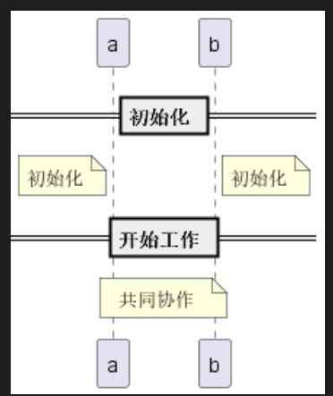

#### 引用

* ref over  参与者.....
* ref  over 参与者   ...........     end ref  

#### 延时

* ...   代表延时操作
* ... 5分钟 ... 代表具体延时

#### 增加空间

* |||  增加空间
* || 45 || 增加指定像素空间

#### 包裹参与者

声明参与者的时候使用下面形式包裹参与者就可以了

* box title 颜色   ......    end box

```
@startuml
box "Internal Service" #LightBlue
participant Bob
participant Alice
end box
participant Other
Bob -> Alice : hello
Alice -> Other : hello
@enduml
```

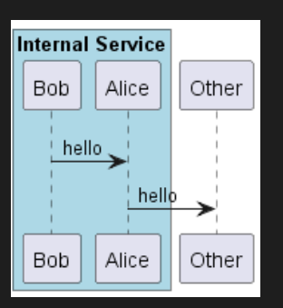

#### 移除下面的参与者图标

* hide footbox

## 用例图

可以使用() 或者usecase关键字定义

```
@startuml
(firstcase) as f
(secondcase) as s 

usecase thridcase as t

@enduml
```

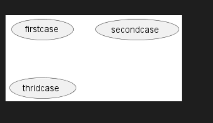

### 角色形象

声明角色

* : user :
* actor user

#### 更改头像

* skinparam actorStyle awesome

```
@startuml
:User: --> (Use)
"Main Admin" as Admin
"Use the application" as (Use)
Admin --> (Admin the application)

skinparam actorStyle awesome
:User1: --> (Use1)
"Main Admin" as Admin1
"Use the application" as (Use1)
Admin1 --> (Admin the application1)
@enduml
```

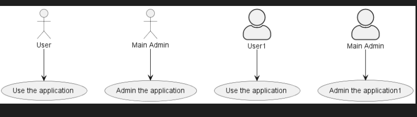

### 用例描述

使用" " 包裹起来,中间开可以加下面几种分割符

* -- 横线
* .. 虚线
* == 双横线
* __ 下划线

```
@startuml

usecase h as "我很好,谢谢你
--
我非常好,谢谢你
== hh ==
我真的很好,谢谢你
..hh..
好的,谢谢你
__
拜拜 "

@enduml
```

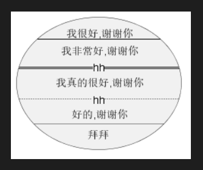

### 使用包

可以使用包将角色或者用例分组

```
@startuml
:djm:


package test{
    usecase test1 as test1
    usecase test2 as test2
    usecase test3 as test3
}
djm -> test1
djm -> test2
djm -> test3


@enduml
```

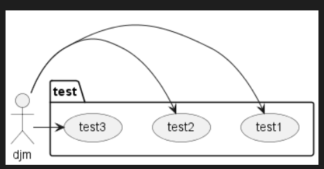

> -> 连接两个用例之间的箭头横杠越多,线条越长

### 继承

a 继承 b 可以表示为:   b<|--a

### 注释

这个和时序图的差不多,只不过这个有四个方位: note left/right/top/bottom of

注释可以定义一个对象,但是连接的时候必须使用 .. 

### 箭头方向

* -left/right/up/down-> 这样可以自定义箭头的方向

```
@startuml

actor :u1:
actor :u2:
actor :u3:

u1 -up-> u2
u1 -left-> u3

@enduml
```

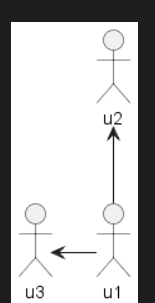

## 类图

### 元素声明

```
abstract         abstract
abstract class   "abstract class"
annotation       annotation
circle           circle
()               circle_short_form
class 		    class
diamond 		diamond
<> 			    diamond_short_form
entity 			entity
enum 			enum
interface 		interface
```

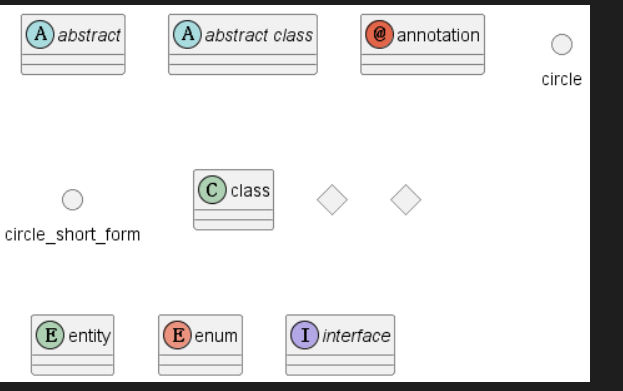

### 类与类之间的关系

* <| --  继承
* *--  组合
* o-- 聚合

### 标签

可以通过在箭头两端加上标签列如

```
@startuml
class01 "类型1"  <|-- "类型2" class02: 继承
@enduml
```

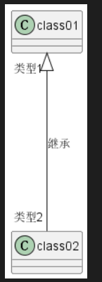

### 添加属性和方法

```
@startuml

Object <|-- Person

class Person{
    String name
    int age
    String getName()
    String getAge()
}

class Object{
    boolean equals()
    int hashCode()
}

@enduml
```

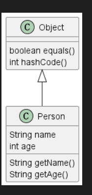

### 定义可访问性

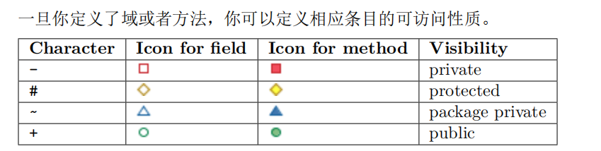

```
@startuml

Object <|-- Person

class Person{
    -String name
    -int age
    +String getName()
    +String getAge()
}

class Object{
    +boolean equals()
    +int hashCode()
}

@enduml
```

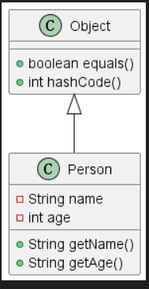

### 抽象和静态

可以在属性前面加上{abstract}和{static}来表示

### 自定义分割线

这个和用例图的差不多

### 指定包

我们可以将某些语句写到一个包里面,这样这个语句里面涉及到的类就在同一个包下

```
@startuml
package java.utils{
    interface Collection 
    interface list 
    interface set
    Collection <|-- list
    Collection <|-- set
}
@enduml
```

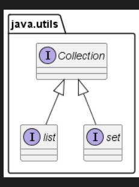

## 对象图

这个比较简单,其实就是类图,只不过,里面的属性要赋值

```
@startuml
object user {
name = "Dummy"
id = 123
}
@enduml
```

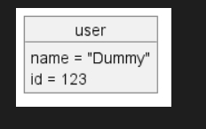

```
@startuml
map "Map<Integer,String>" as map{
    1 => "1"
    2 => "2"
}
@enduml
```

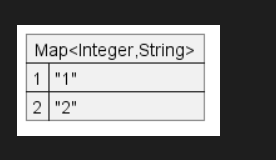